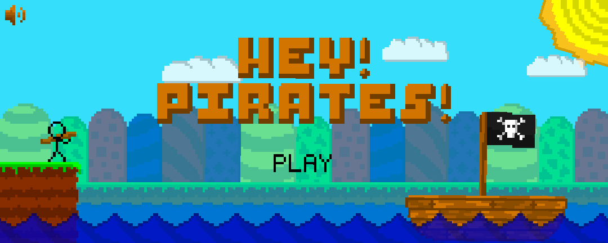
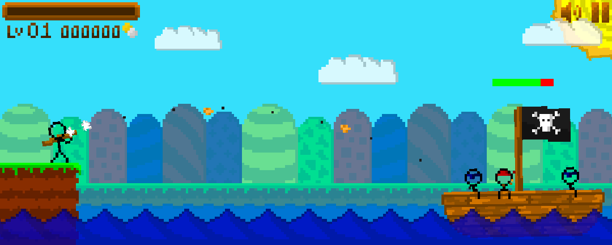
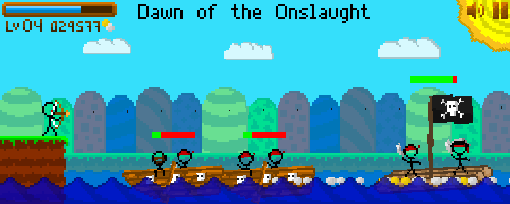

# HEY PIRATES
A game where you defend the coast from pirates with a potato gun. Made with GameMaker: Studio 1.4  

## Controls
* Left click to shoot
* Right click to change weapon
* Esc to exit the game

## Notes
* See datafiles/Hey_Pirates_WIP.exe for the compiled game.
* Most of the game code is in objects/
* The shop was never fully implemented, clicking the shop icon will lock the game.
* Inspired by a grade 12 physics question.

## Preview

